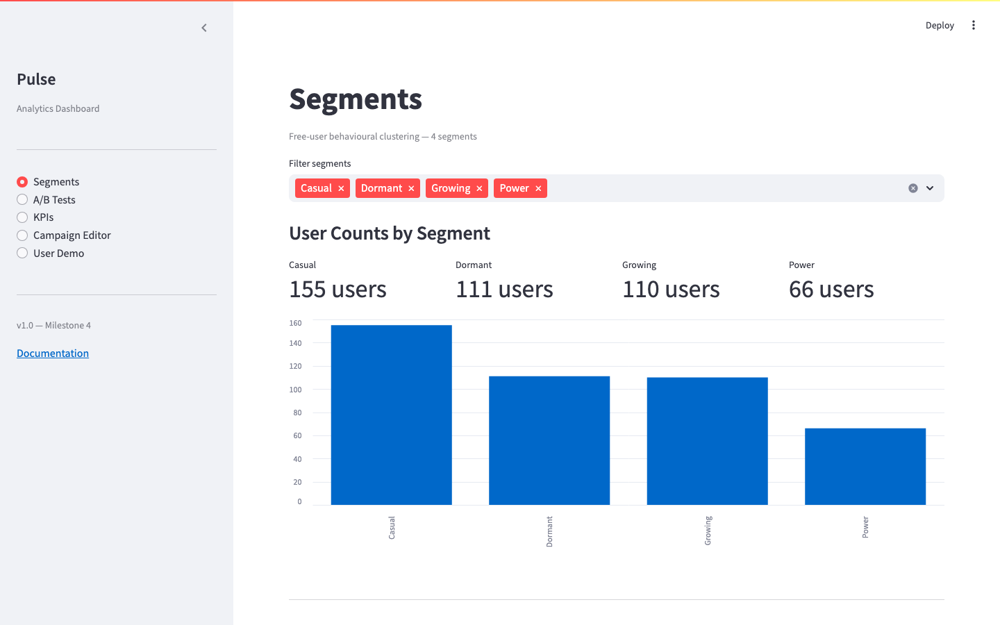
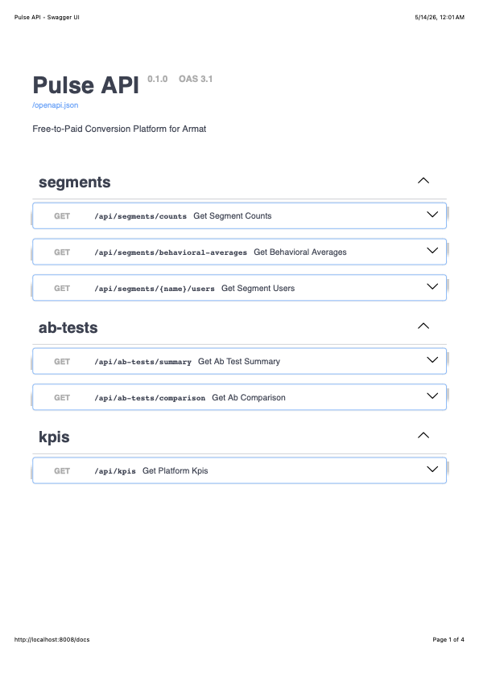

# Pulse — Free-to-Paid Conversion Platform

> DS-223 Marketing Analytics · Group 7 · American University of Armenia · Spring 2026

Pulse is a microservice application that helps Armat (an Armenian writing SaaS) convert free-tier users to paid Pro subscribers. It segments users by behaviour, lets the PM team launch targeted campaigns, run A/B tests, and track conversion KPIs in real time.

---

## Screenshots

| Segments | A/B Tests |
|----------|-----------|
|  |  |

| KPIs | Campaign Editor |
|------|-----------------|
|  |  |

| User Demo | API (Swagger UI) |
|-----------|-----------------|
|  |  |

---

## Prototypes

| Version | Link |
|---------|------|
| Must Have | [prototype-must-have](https://willowy-dodol-1d69c6.netlify.app/) |
| Should & Nice to Have | [prototype-should-have](https://starlit-pastelito-981ea4.netlify.app/) |

---

## Team

| Name | Role |
|------|------|
| Silva Vardanyan | Product Manager & Data Scientist |
| Albert Hakobyan | Backend Developer |
| Anzhelika Simonyan | Frontend Developer |
| Narek Dilbaryan | Database Engineer |

---

## Architecture

```
ds223-7-project/
├── docker-compose.yml
├── .env
└── pulse/
    ├── api/        FastAPI backend          →  localhost:8008
    ├── app/        Streamlit dashboard      →  localhost:8501
    ├── ds/         DS scripts + notebooks   →  localhost:8888
    ├── etl/        DB seed + migration pipeline (exits after run)
    └── pgadmin/    pgAdmin auto-configuration
```

Five Docker containers run together:

| Container | Description | Port |
|-----------|-------------|------|
| `db` | PostgreSQL 16 database | 5433 |
| `pgadmin` | pgAdmin UI | 5050 |
| `back` | FastAPI REST backend | 8008 |
| `front` | Streamlit dashboard | 8501 |
| `ds` | Jupyter + DS scripts | 8888 |
| `etl` | Seeds the database, then exits | — |

---

## Quick Start

**Requirements:** Docker + Docker Compose

```bash
# 1. Clone the repo
git clone https://github.com/DS-223-2026-Spring/ds223-7-project.git
cd ds223-7-project

# 2. Credentials are already set in .env (dev defaults — no changes needed)

# 3. Build and start all containers
docker-compose up --build
```

> **Note:** On a machine with a stale volume, run `docker-compose down -v` first to get a clean DB.

| Service | URL |
|---------|-----|
| Streamlit dashboard | http://localhost:8501 |
| FastAPI Swagger UI | http://localhost:8008/docs |
| Jupyter notebooks | http://localhost:8888 |
| pgAdmin | http://localhost:5050 |

**pgAdmin login:** `admin@pulse.com` / `admin`

The ETL container runs automatically on first start, creates all tables, and seeds **442 users** with full behavioral data across all 4 segments.

---

## DS Pipeline

After the stack is up, run the full DS pipeline inside the `ds` container:

```bash
docker-compose exec ds bash run_ds_pipeline.sh
```

This runs three steps in order:

| Step | Script | Output |
|------|--------|--------|
| 1 | `run_ab_analysis.py` | Thompson Sampling → `ab_test_results` table |
| 2 | `predict.py` | Logistic Regression → `user_conversion_scores` table (442 users) |
| 3 | `segment_summary.py` | Per-segment summary → `outputs/segment_summary.json` |

Or run steps individually:

```bash
docker-compose exec ds python run_ab_analysis.py
docker-compose exec ds python predict.py
docker-compose exec ds python segment_summary.py
```

---

## Dashboard Pages

| Page | Description |
|------|-------------|
| Segments | User counts per segment, behavioral averages, per-user breakdown table with conversion probability |
| A/B Tests | Control vs treatment stats, lift %, Thompson Sampling p-value per segment |
| KPIs | Platform-level conversion rate, engagement, churn, revenue |
| User Demo | Simulate upgrade messages per segment and record user responses live |
| Campaign Editor | Edit messages, set channels and triggers, launch A/B tests |

---

## User Segments

Live values from the seeded database:

| Segment | Users | Avg Sessions/wk | Avg Exports | Strategy |
|---------|-------|-----------------|-------------|----------|
| Power | 66 | 7.6 | 9.5 | Upsell — hit export limits regularly |
| Growing | 110 | 4.2 | 5.2 | Nurture — rising usage, highlight Pro features |
| Casual | 155 | 1.7 | 2.5 | Re-engage — template library hook |
| Dormant | 111 | 0.3 | 1.1 | Win-back — 30% discount + urgency |
| **Total** | **442** | | | |

---

## Key KPIs

Live values from the running system:

| Metric | Value |
|--------|-------|
| Overall conversion rate | 4.0% |
| Avg revenue per converted user | 2,900 AMD/month |
| Power segment conversion prob (ML) | 64.3% |
| Growing segment conversion prob (ML) | 53.4% |
| Casual segment conversion prob (ML) | 45.6% |
| Dormant segment conversion prob (ML) | 31.8% |

---

## API Endpoints

Full interactive docs at **http://localhost:8008/docs**

| Method | Endpoint | Description |
|--------|----------|-------------|
| GET | `/health` | Service health check |
| GET | `/api/segments/counts` | User count per segment |
| GET | `/api/segments/behavioral-averages` | Avg exports, paywall hits, sessions per segment |
| GET | `/api/segments/{name}/users` | Up to 50 users in a segment with conversion probability |
| GET | `/api/ab-tests/summary` | A/B test results per segment (Thompson Sampling) |
| GET | `/api/ab-tests/comparison` | Side-by-side control vs treatment comparison |
| GET | `/api/kpis` | Platform-level conversion metrics |
| GET | `/api/campaigns` | All campaigns with active messages |
| GET | `/api/campaigns/{id}` | Single campaign detail |
| PUT | `/api/campaigns/{id}` | Update campaign fields |
| PUT | `/api/campaigns/{id}/message` | Update the active message body |
| POST | `/api/campaigns/{id}/launch` | Launch a campaign (draft → running) |
| DELETE | `/api/campaigns/{id}/reset` | Reset campaign to draft |
| GET | `/api/global-params` | Shared campaign parameters (price, discount, etc.) |
| PUT | `/api/global-params/{key}` | Update a global parameter value |
| GET | `/api/demo/message/{segment_name}` | Get the rendered upgrade message for a segment |
| POST | `/api/demo/respond` | Record a demo user response (upgraded / dismissed) |

---

## DB Validation & Stability

```bash
# Validate all 20 app queries pass against the running DB
docker-compose run --rm etl python validate_app_queries.py

# Run CRUD + view stability checks
docker-compose run --rm etl python check_stability.py
```

Expected: **20/20 passed** and **6/6 passed**.

---

## Documentation

Full project documentation:
**https://ds-223-2026-spring.github.io/ds223-7-project/**

To preview locally:

```bash
pip install -r requirements-docs.txt
mkdocs serve
```

Then open **http://localhost:8000**

The docs site auto-deploys on every push to `main` via `.github/workflows/ci.yaml`.

---

## Tech Stack

| Layer | Technology |
|-------|-----------|
| Frontend | Streamlit + Altair |
| Backend | FastAPI + Uvicorn |
| Database | PostgreSQL 16 |
| ORM | SQLAlchemy |
| Validation | Pydantic v2 |
| ML | scikit-learn (Logistic Regression) |
| A/B Testing | Thompson Sampling (Beta-Binomial) |
| ETL | Python + psycopg2 |
| Containers | Docker Compose |
| Documentation | MkDocs Material |
