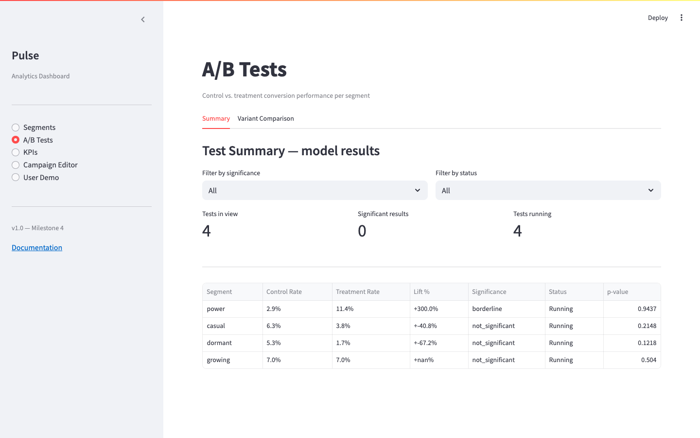
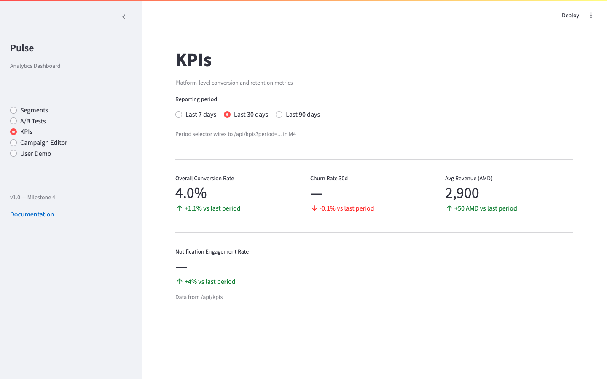
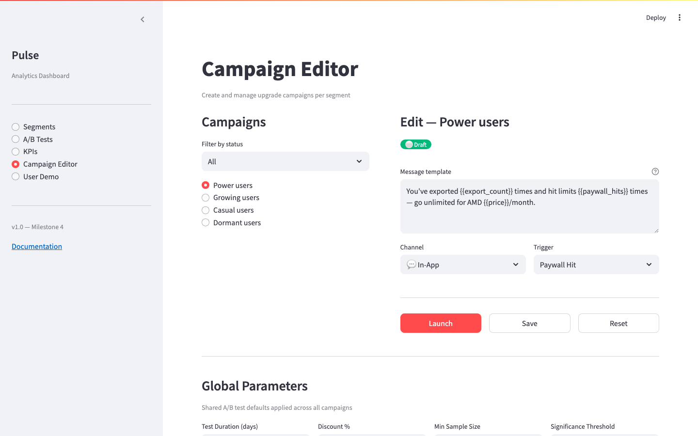
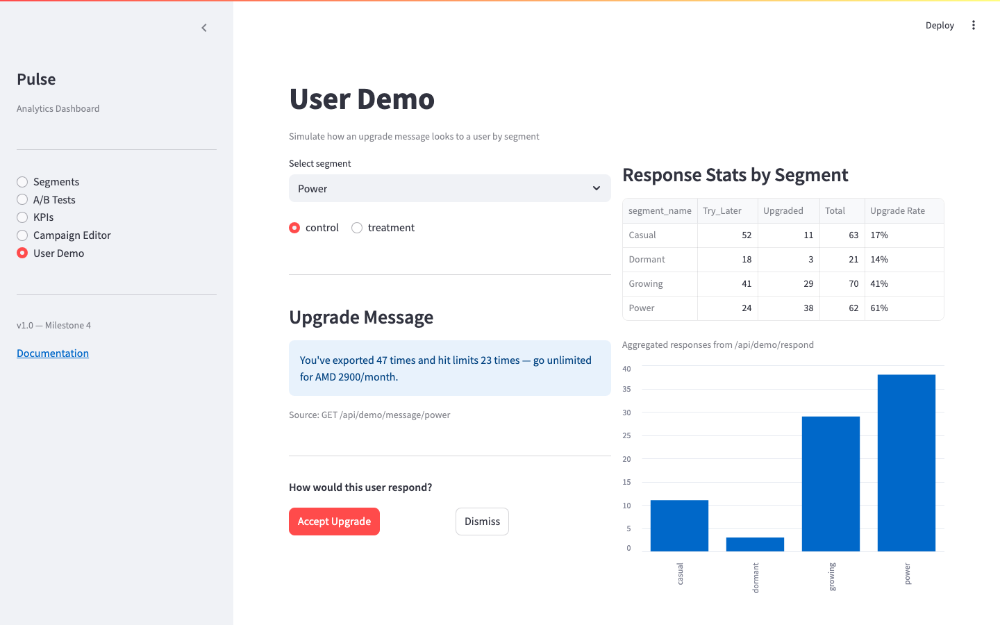

# Demo

Live walkthrough of the Pulse Analytics Dashboard — Milestone 4.

**Stack:** Streamlit frontend · FastAPI backend · PostgreSQL · Docker Compose  
**Run it:** `docker-compose up --build` → open [http://localhost:8501](http://localhost:8501)

---

## Segments

Free-user behavioural clustering across 4 segments. The PM team uses this screen to understand who their users are and prioritise conversion actions.


**What you see:**

| Metric | Value |
|--------|-------|
| Casual users | 155 |
| Dormant users | 111 |
| Growing users | 110 |
| Power users | 66 |
| **Total** | **442** |

The bar chart is powered by Altair and reads live from `GET /api/segments/counts`.  
Scroll down on this screen to see **behavioural averages** (sessions/week, exports, paywall hits) and a **per-user breakdown table** with ML-predicted conversion probabilities from `GET /api/segments/{name}/users`.

---

## A/B Tests

Thompson Sampling A/B test results — control vs. treatment conversion rates per segment.



**Current results (from live DB):**

| Segment | Control | Treatment | Lift | Result |
|---------|---------|-----------|------|--------|
| power | 2.9% | 11.4% | +300% | borderline |
| casual | 6.3% | 3.8% | −40.8% | not significant |
| dormant | 5.3% | 1.7% | −67.2% | not significant |
| growing | 7.0% | 7.0% | 0% | not significant |

The **Variant Comparison** tab (top of screen) shows a side-by-side breakdown.  
Data source: `GET /api/ab-tests/summary` and `GET /api/ab-tests/comparison`.

---

## KPIs

Platform-level conversion and retention metrics.



**Live metrics:**

| KPI | Value |
|-----|-------|
| Overall conversion rate | **4.0%** |
| Avg revenue per converted user | **2,900 AMD/month** |
| Churn Rate 30d | — *(insufficient event data)* |
| Notification Engagement Rate | — *(insufficient event data)* |

Reporting period selector (Last 7 / 30 / 90 days) wires to the backend in M4.  
Data source: `GET /api/kpis`.

---

## Campaign Editor

Create and manage upgrade campaigns per segment. Edit message templates, set delivery channel and trigger event, then launch.



**How to use:**

1. Select a segment from the left panel (Power / Growing / Casual / Dormant)
2. Edit the **Message template** — use `{{export_count}}`, `{{paywall_hits}}`, `{{price}}` as placeholders
3. Set **Channel** (In-App / Email / Push) and **Trigger** (Paywall Hit / Session Start / etc.)
4. Click **Launch** to activate the campaign, **Save** to keep as draft, or **Reset** to revert
5. Scroll down to adjust **Global Parameters** (test duration, discount %, min sample size, significance threshold)

Backend calls: `GET /api/campaigns`, `PUT /api/campaigns/{id}/message`, `POST /api/campaigns/{id}/launch`, `GET /api/global-params`, `PUT /api/global-params/{key}`.

---

## User Demo

Simulate the upgrade message a real user would see for their segment. Record their simulated response to feed conversion outcome data back into the system.



**How to use:**

1. Select a segment from the dropdown
2. The rendered upgrade message for that segment is fetched live (`GET /api/demo/message/{segment_name}`)
3. Click **Upgraded** or **Dismissed** to record the outcome
4. The response is written to `conversion_outcomes` via `POST /api/demo/respond`

This feeds real interaction data back into the ML pipeline — running `predict.py` after recording responses will update conversion probabilities.

---

## API — Swagger UI

All 17 endpoints are documented and testable at [http://localhost:8008/docs](http://localhost:8008/docs).


**Endpoint groups:**

| Group | Endpoints |
|-------|-----------|
| segments | `GET /api/segments/counts`, `/behavioral-averages`, `/{name}/users` |
| ab-tests | `GET /api/ab-tests/summary`, `/comparison` |
| kpis | `GET /api/kpis` |
| campaigns | `GET/PUT /api/campaigns/{id}`, `/launch`, `/message`, `/reset` |
| global-params | `GET/PUT /api/global-params/{key}` |
| demo | `GET /api/demo/message/{segment_name}`, `POST /api/demo/respond` |
| health | `GET /health` |

---

## Running the DS Pipeline

After `docker-compose up --build`, run the full data science pipeline to populate ML scores and A/B results:

```bash
docker-compose exec ds bash run_ds_pipeline.sh
```

This runs three steps:

| Step | Script | Writes to |
|------|--------|-----------|
| 1 | `run_ab_analysis.py` | `ab_test_results` table |
| 2 | `predict.py` | `user_conversion_scores` table (442 users scored) |
| 3 | `segment_summary.py` | `outputs/segment_summary.json` |

After the pipeline completes, the Segments screen will show conversion probabilities per user and the A/B Tests screen will show Thompson Sampling results.
